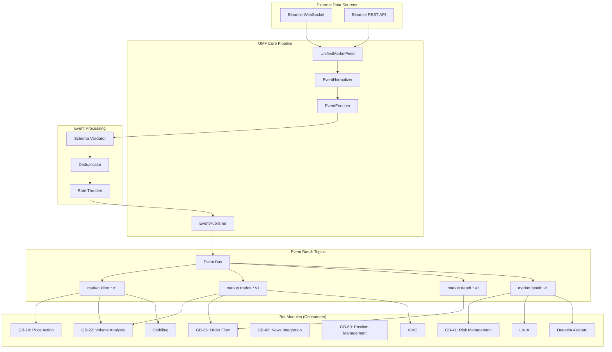
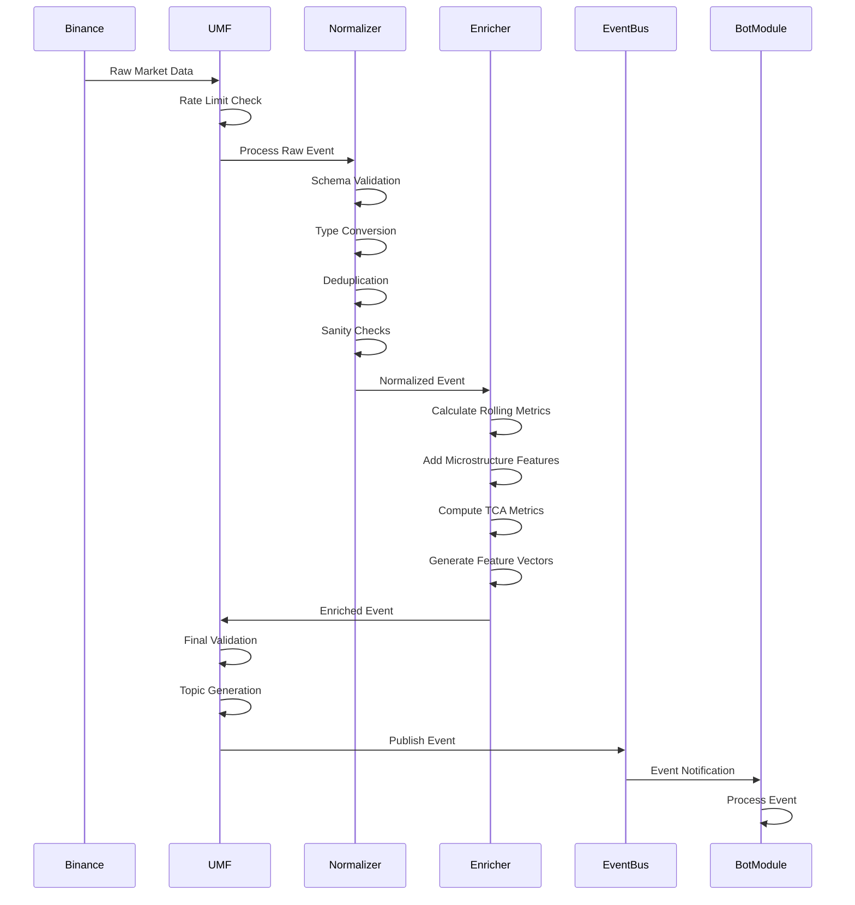
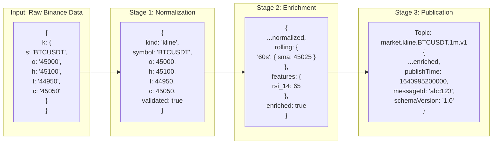
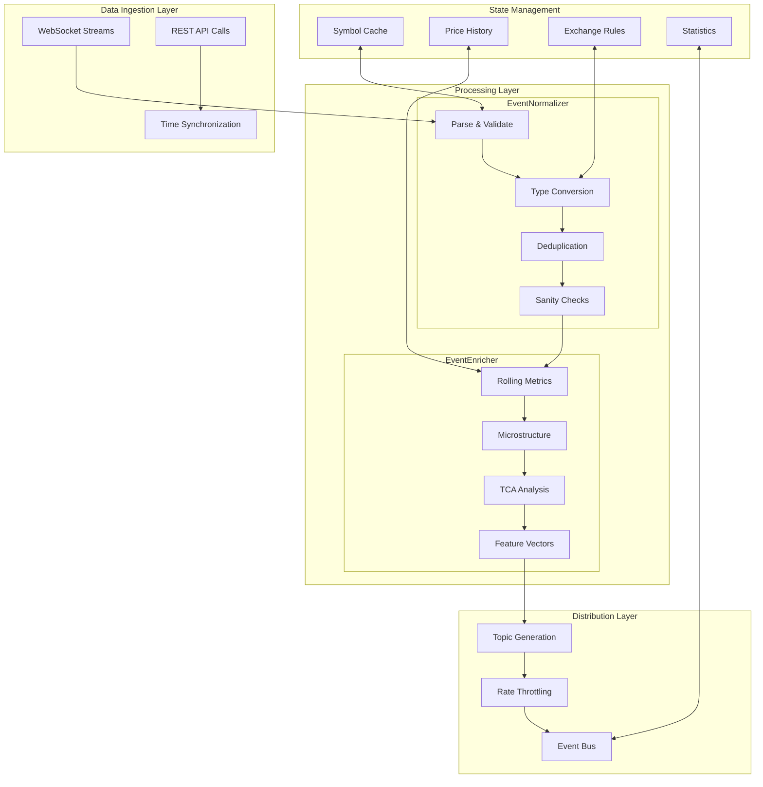
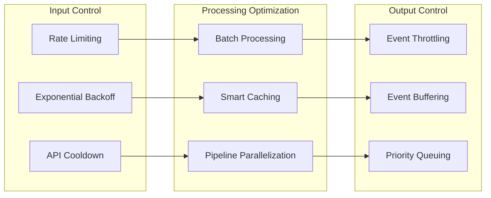
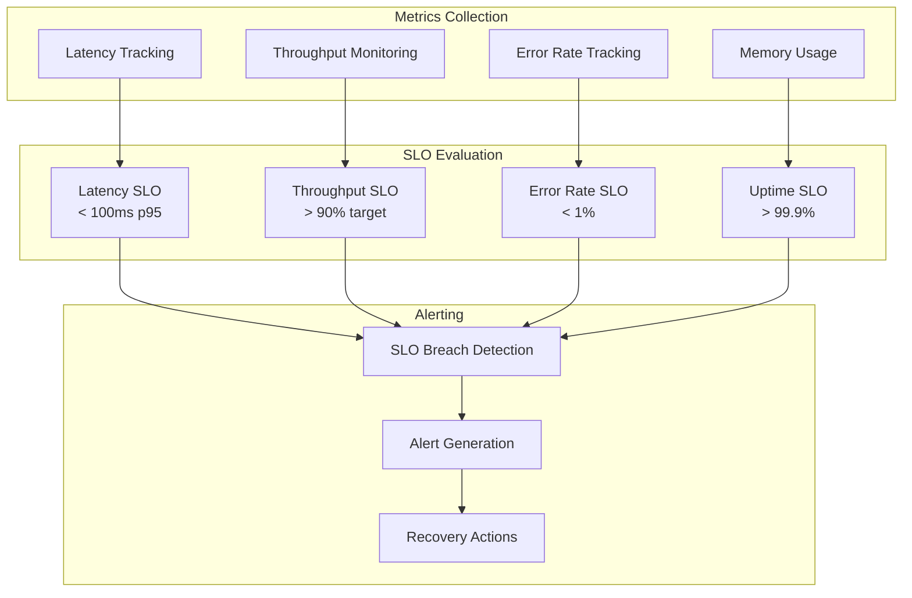
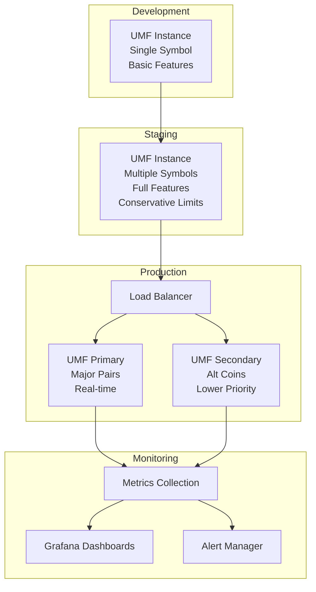

# Enhanced UMF - System Architecture & Data Flow

## 🏗️ High-Level Architecture



## 🔄 Data Processing Pipeline



## 📊 Event Transformation Flow



## 🎯 Module Subscription Matrix

| Bot Module | Kline | Trades | Depth | Ticker | Funding | Orders | Health |
|------------|-------|--------|-------|--------|---------|--------|--------|
| GB-10 (Price Action) | ✅ | ❌ | ❌ | ✅ | ❌ | ❌ | ❌ |
| GB-22 (Volume) | ✅ | ✅ | ❌ | ❌ | ❌ | ❌ | ❌ |
| GB-36 (Order Flow) | ❌ | ✅ | ✅ | ✅ | ❌ | ❌ | ❌ |
| GB-41 (Risk) | ✅ | ✅ | ✅ | ❌ | ✅ | ✅ | ✅ |
| GB-42 (News) | ✅ | ❌ | ❌ | ❌ | ✅ | ❌ | ❌ |
| GB-60 (Position) | ❌ | ✅ | ❌ | ❌ | ❌ | ✅ | ❌ |
| Otobilinç | ✅ | ✅ | ✅ | ❌ | ❌ | ❌ | ❌ |
| VIVO | ✅ | ✅ | ❌ | ✅ | ❌ | ❌ | ✅ |
| LIVIA | ❌ | ❌ | ❌ | ❌ | ❌ | ❌ | ✅ |
| Denetim Asistanı | ❌ | ❌ | ❌ | ❌ | ❌ | ❌ | ✅ |

## 🔧 Component Interaction Diagram



## ⚡ Performance Optimization Flow



## 🏥 Health Monitoring Architecture



## 🔄 Deployment & Scaling Strategy



## 🎛️ Configuration Management

```yaml
# config/development.yaml
umf:
  mode: conservative
  symbols: ['BTCUSDT']
  streams: ['kline_1m', 'trade']
  enableEnrichment: false
  maxEventsPerSecond: 10

# config/staging.yaml  
umf:
  mode: standard
  symbols: ['BTCUSDT', 'ETHUSDT']
  streams: ['kline_1m', 'kline_5m', 'trade']
  enableEnrichment: true
  maxEventsPerSecond: 50

# config/production.yaml
umf:
  mode: optimized
  symbols: ['BTCUSDT', 'ETHUSDT', 'ADAUSDT', 'BNBUSDT']
  streams: ['kline_1m', 'kline_5m', 'trade', 'depth']
  enableEnrichment: true
  enableTCA: true
  maxEventsPerSecond: 200
  rollingWindows: [60, 300, 900, 3600]
```
